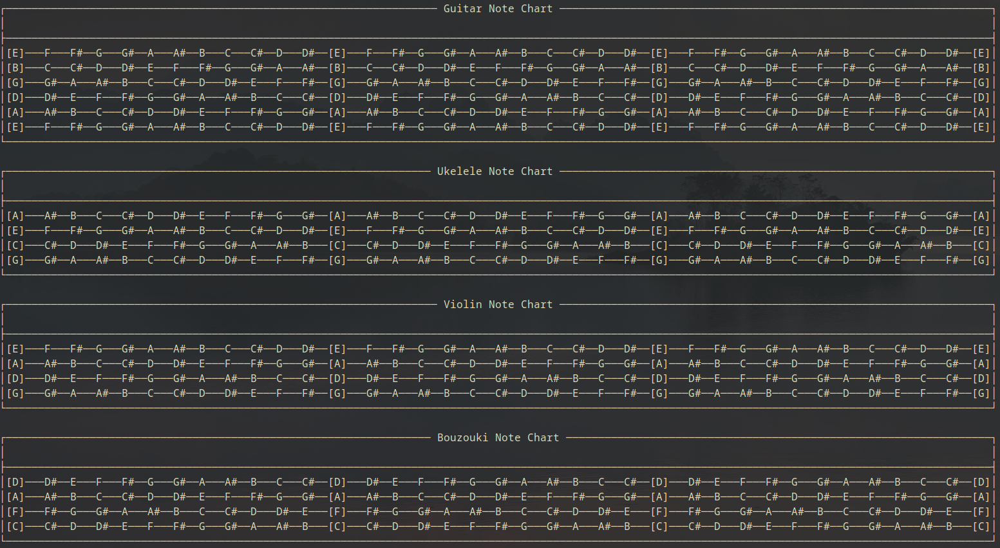

# String Instrument Note Diagram

Python script which prints the notes of string instruments to the console.



## Run

```
python note-diagram.py
```

## Future Ideas

- [x] Specify number of frets?
- [ ] Displaying the information with more visual appeal. (Perhaps as an image?, Text spaced out better?)
- [ ] Include which octave (ie C4), frequency of each note?
- [ ] Display as a website.
